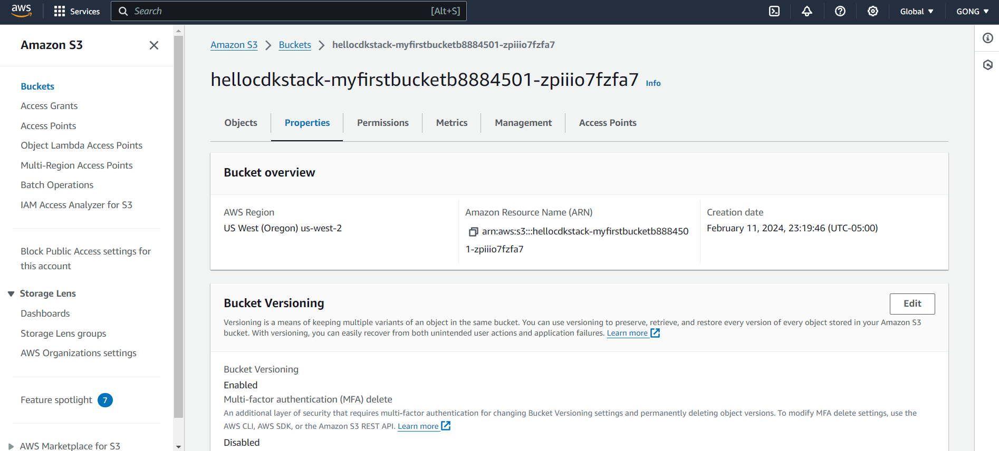

## Project Overview

This project utilizes the AWS Cloud Development Kit (CDK) with TypeScript to automate the deployment of a specifically configured Amazon S3 bucket, demonstrating efficient cloud resource management through infrastructure as code (IaC) practices.

### Bucket Properties

The centerpiece of this project is the deployment of an Amazon S3 bucket with the following configurations:

- **Versioning**: This is enabled to preserve multiple versions of an object in the same bucket, which is essential for restoring previous states in case of accidental deletions or modifications.

- **Encryption**: The bucket uses server-side encryption with AWS Key Management Service (KMS) managed keys (SSE-KMS), ensuring that the data is encrypted at rest for enhanced security.

- **Removal Policy**: Set to automatically destroy the bucket and its contents upon the deletion of the CDK stack. This feature is invaluable during development and testing phases to prevent accruing unnecessary costs and to maintain a tidy AWS environment.

- **AutoDeleteObjects**: This feature is activated to ensure the automatic deletion of all objects within the bucket when the bucket is removed. It is a critical feature for avoiding orphaned objects and keeping the environment clean after the stack is deleted.

This project serves as a foundational template for developers aiming to utilize the CDK for streamlined cloud infrastructure management, illustrating how to set up a secure and efficiently managed S3 bucket.

## Useful commands

* `npm run build`   compile typescript to js
* `npm run watch`   watch for changes and compile
* `npm run test`    perform the jest unit tests
* `cdk deploy`      deploy this stack to your default AWS account/region
* `cdk diff`        compare deployed stack with current state
* `cdk synth`       emits the synthesized CloudFormation template

## Generated S3 bucket screenshot

## Writeup explaining CodeWhisperer usage
To start writing CDK code for an S3 storage bucket, I enter comments describing what to do, such as '"Create an S3 bucket with..."' which invokes CodeWhisperer. I then checked the code provided by CodeWhisperer and found that it is almost identical to the code in the tutorial, so I used it. After that, I used CodeWhisperer to add bucket properties like versioning and encryption, It helped me complete the TypeScript code with specific configurations. I believed that its suggestions met the requirements, so I applied them directly to my codebase.
